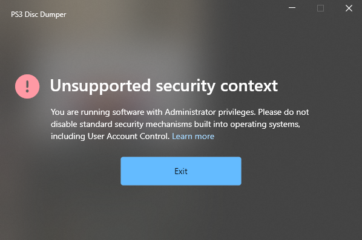

# ps3-disc-dumper UAC bypass

## What is this?

In this repository you will find a simple batch-script file with name "Loader.cmd" that serves to run [PS3 Disc Dumper](https://github.com/13xforever/ps3-disc-dumper) program without the UAC restriction.

In other words, it will let you run and use the program under an Administrator account to get rid of this error message:

## Usage

Simply put the 'Loader.cmd' script file together with the 'ps3-disc-dumper.exe' executable file, and run the script file.

## Is this batch-script file really necessary?

Of course it is not; you can always open a command-prompt and pass the next argument to run 'ps3-disc-dumper.exe' file: 
 - `/IUnderstandThatRunningSoftwareAsAdministratorIsDangerousAndNotRecommendedForAnyone`
   (see: [SecurityEx.cs](https://github.com/13xforever/ps3-disc-dumper/blob/master/Ps3DiscDumper/Utils/SecurityEx.cs#L16))

But let me tell you a brief history:

I was about to fork 'ps3-disc-dumper' to modify the source code and thus share a compiled version without the restrictions, but while analyzing the source code I found that command line argument available but intentionally "hidden" and undocumented by the author, so I make it available to you through this batch-script file, because: 
1. Not everyone has the time or experience to look at the source code and find the "key".
2. I can't respect the decission of this command-line switch to be hidden to the public, so with this repository I'll try to mgive visibility t that command-line switch, since [the author denies to mention it to end-users that requested a solution for this issue, and while also trying to indoctrinate and enforce his own and unique vision of doing things and using an operating system "in the correct and only way"](https://github.com/13xforever/ps3-disc-dumper/issues/34#issuecomment-1615844934). Come on...

A software should not invade or interfere with user preferences; It is the software that must adapt to the end user's environment, and not the other way around.

That's all. Long live freedom of choice, and enjoy this!.
